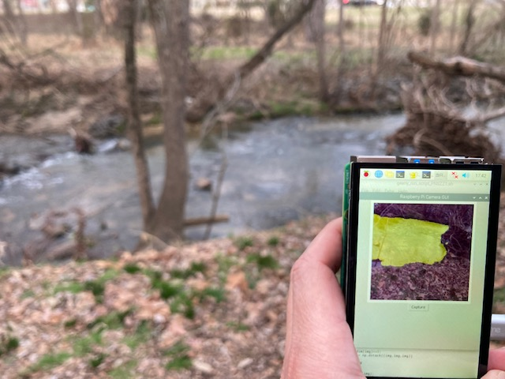
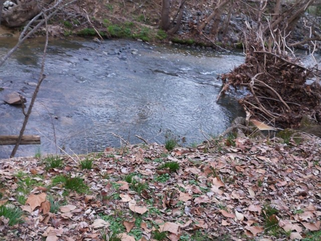
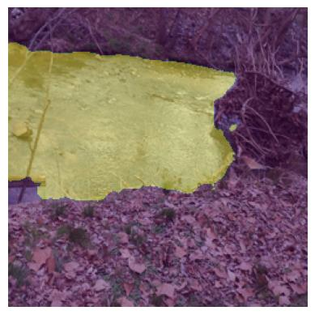

# WaterCam

A camera for segmenting water images in the field.

The device is a Raspberry Pi 4, Hyperpixel display, Camera Module 3, and an on-board ML model that was made with the [RIWA dataset](https://www.kaggle.com/dsv/4289421) and [Segmentation Gym](https://github.com/Doodleverse/segmentation_gym).

Each picture takes ~3 seconds to segment and display on screen. Future work is focused on decreasing this latency.

